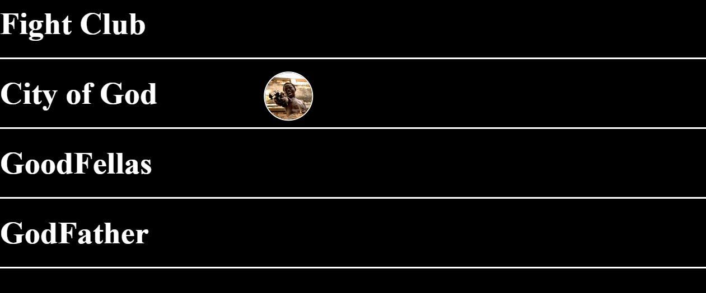

#  Project 13 - Custom cursor 2 

##  How it works

- A slightly different sort of a cursor , when moved towards a particular '
' of a movie, cursor gets the movie's poster!

## 🛠️ Tech Used

- HTML
- CSS
- JavaScript

##  What it looks like

