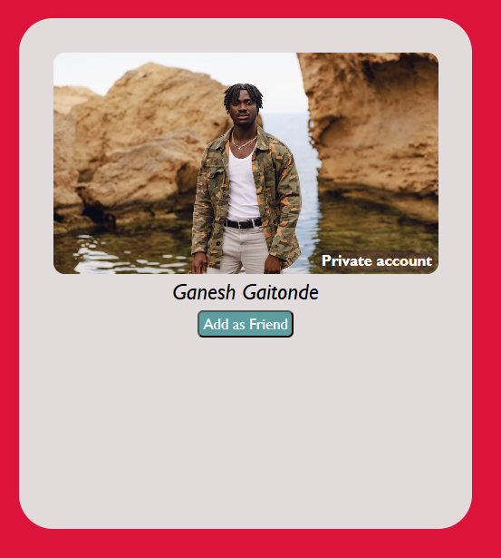
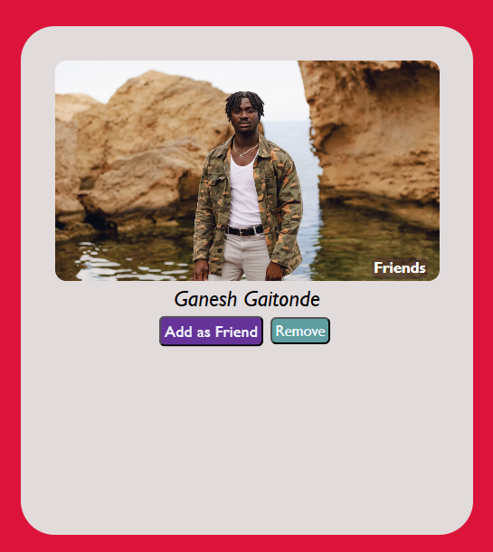

#  Project 10 - Friend request mechanis,!

A simple usage of DOM concepts

##  How it works

- A simple toggle to add someone as friend or remove
- Change of text and status using DOM

## 🛠️ Tech Used

- HTML
- CSS
- JavaScript

##  What it looks like

