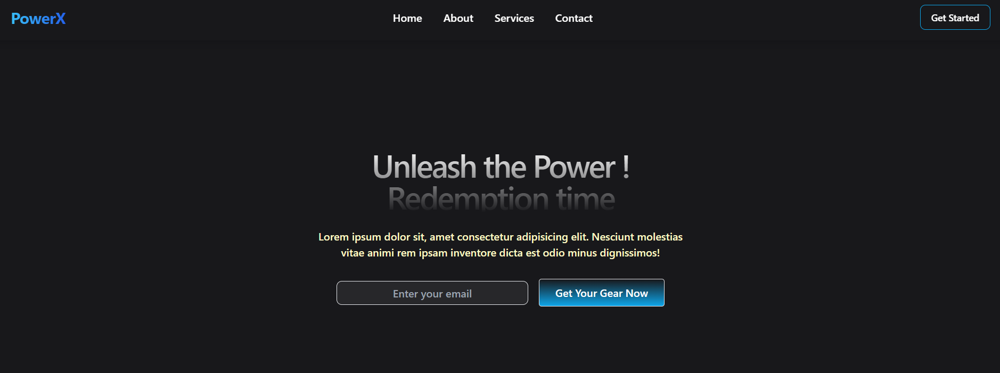

# 🌐 Project 19 - A Simple Web Design  

## 📖 Description  
This project is a **practice in building a modern landing page UI** using **React + Tailwind CSS**.  
The goal is to understand how comfortable I am with Tailwind utility classes, responsive design, and component-based styling.  

---

## 🛠️ Tech Stack  
- ⚛️ React – Component-based UI  
- Tailwind CSS – Utility-first styling  

---

## 📸 Screenshots  

  

