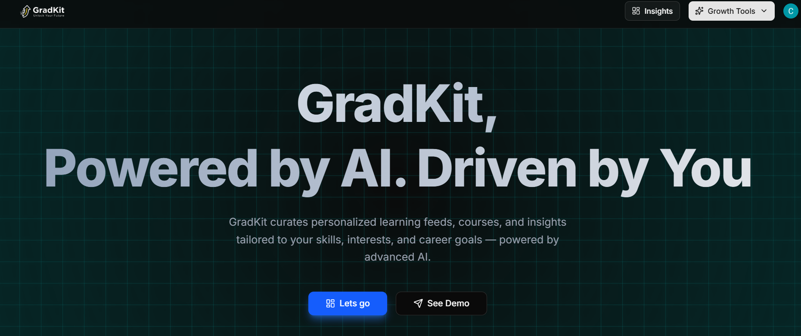
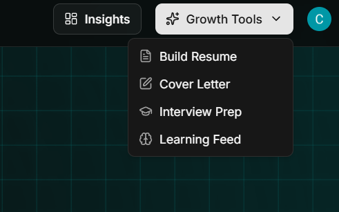

# **GradKit**  
**Your Intelligent Career Growth Companion**

---

GradKit is a modern platform that helps learners and professionals stay industry-ready — all in one place.  

Check live industry insights, track your growth, give mock interviews, generate tailored resumes & cover letters, and receive weekly learning feeds — powered by AI.

---

## **Home Page Overview**

The home dashboard greets you with a clean, distraction-free interface.  

It surfaces your current learning streak, upcoming mock interviews, recent industry trends, and weekly AI-curated updates.  

Every section is designed for **clarity, minimalism, and flow** — so you can focus on what matters: growth.

---

## **Core Features**

### 1. Industry Insights
- Real-time data on trending technologies, job market shifts, and skill demands.  
- Ingested weekly via **Gemini API** for always-fresh, reliable insights.

### 2. Learning Feed
- Personalized feed tailored to your selected industry (e.g. AI, FinTech, Design, etc.).  
- Aggregated automatically using your preferences and recent engagement.

### 3. Mock Interviews & Scores
- Practice technical and behavioral interviews.  
- Get instant AI-based feedback with scoring and improvement suggestions.  
- Designed to simulate real-world interview pressure in a safe environment.

### 4. Resume & Cover Letter Builder
- Generate ATS-friendly resumes and persuasive cover letters in seconds.  
- Gemini-powered content recommendations help you stand out.

### 5. Weekly AI Digest
- Automated ingestion pipeline fetches the latest market & tech updates every week.  
- Summarized concisely by Gemini API for quick consumption.

---

## **Under the Hood (Tech Stack)**

GradKit is built with the philosophy of **clarity, performance, and constant iteration**, inspired by Andrej Karpathy’s engineering approach — *“simple things that scale.”*

| Layer | Technology | Description |
|-------|-------------|-------------|
| **Frontend** | [Next.js 14](https://nextjs.org/) + [React 18](https://react.dev/) | Modern app router, server components, lightning-fast SSR. |
| **Styling** | Tailwind CSS + Shadcn UI | Clean, minimal, consistent design system. |
| **Auth** | [Clerk](https://clerk.dev/) | Secure, frictionless authentication & user management. |
| **Database** | [Neon DB](https://neon.tech/) (PostgreSQL) | Scalable cloud-native Postgres with branching support. |
| **AI Engine** | [Gemini API](https://ai.google.dev/) | Powers content generation, insights, and interview analysis. |
| **Data Ingestion** | Ingest API + Cron Jobs | Weekly automation of industry feed updates. |

---

